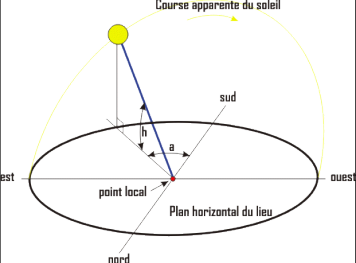
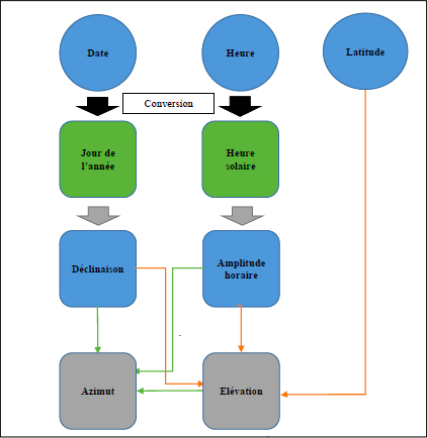
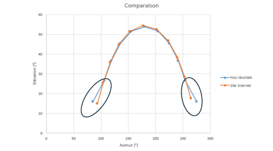

# Équation du soleil

## Analyse et solutions

Tout d’abord, pour pouvoir diriger le tracker photovoltaïque nous devons
valider les équations qui permettent de connaître la position du soleil.
Avant de les vérifier, nous devons d’abord effectuer des recherches pour
comprendre à quoi correspondent ces équations. Puis nous avons cherché des
sites internet qui permettent de calculer la position du soleil en fonction des
coordonnées géographiques afin de pouvoir les comparer à nos résultats.
Nous allons nous servir des sites « Sunearthtools » et « Solartopo ».  
 
 
 
**Hauteur ou Élévation**, h est la hauteur angulaire du Soleil sur l’horizon (plan
vertical). 
**Azimut a**, l’angle entre le sud et la projection au sol de la droite issue de la
direction terre-soleil (plan horizontal). 
Pour récupérer le plus d’énergie du soleil, il faut que les rayons soient
perpendiculaires au panneau, pour cela nous avons besoin de connaître
l’azimut et l’élévation afin d’adapter la position du panneau. 
En effet, un tracker solaire sur deux axes permet d’améliorer de 35% le
rendement de production par rapport à un panneau fixe. 
L’axe horizontal sert à régler l’azimut, ce qui nous permet de suivre l’avancée
du soleil dans la journée, tandis que l’axe vertical, pour l’élévation, permet
d’être plus précis et de pouvoir régler l’orientation en fonction des saisons.

Pour obtenir la position exacte du soleil nous nous basons sur l’azimut et
l’élévation. Ces deux caractéristiques nous permettent d’obtenir la position
avec exactitude. Pour avoir ces deux indications nous nous appuyons sur de
nombreux paramètres. 
Pour calculer ces deux angles, nous devons effectuer des calculs
intermédiaires et pour pouvoir les réaliser il faut connaître les coordonnées GPS
du lieu, la date et l’heure. 
Pour montrer les interactions entre les différentes équations vous trouverez un
schéma ci-dessous. 
 
  
 
En comparant les courbes représentant la trajectoire du soleil obtenu les
années précédentes par rapport aux valeurs réelles, on remarque un manque
de précision au coucher et au lever du soleil. 
De ce fait, il nous a été demandé de revoir les équations qui ont permis
d’obtenir ces courbes soit l’azimute et l’élévation, les deux éléments
permettant de caractériser la trajectoire du soleil. 
 
 
 

Après des recherches assidues, nous avons réussi à obtenir des équations plus
précises car elles prenaient en compte de nombreux facteurs qui pouvaient
influer sur la position du soleil. Ci-dessous nous allons expliquer les équations qui
nous permettent d’obtenir l’azimute et l’élévation ainsi que celles qui en
découlent. 

**Explication de l’équation de l’élévation** 

Les résultats que nous utilisons de l’équation finale dépendent de deux
facteurs. L’angle solaire zénithal correspondant à l’angle entre le zénith et
le centre du disque solaire mais également de la réfraction atmosphérique
qui est une correction qu’on ajoute par rapport aux conditions
atmosphériques. 

Elévation final= 90 – angle solaire du zénith (en deg) + réfraction
atmosphérique 

Ensuite, l’angle solaire correspondant à une équation qui dépend de la
latitude soit un facteur fixe qu’on prédéfinit au départ sur l’Excel, dans notre
cas nous prenons la latitude de l’IUT GIM à Montaury. Cette équation prend
également en compte la déclinaison du soleil et l’angle horaire. 
 
 

Angle solaire zénithale= Acos [sin(latitude)*sin (déclinaison du soleil)
+cos(latitude)*cos (déclinaison du soleil) *cos (angle horaire)]*360/2π 

Tous les angles dans l’équation sont en radians et nous multiplions le tout
par 360 et divisons par 2 π pour obtenir l’angle solaire zénithale en degrés. 

**La déclinaison solaire** est l'angle formé par la droite reliant la terre
au soleil et le plan équatorial.

Angle horaire
L'observateur est au centre. Le disque
horizontal correspond à l'Equateur. Le
disque vertical est formé par le cercle
qui relie le pôle Nord céleste,
le zénith (local) et le pôle Sud céleste.
La petite sphère orange représente
l'étoile. L'angle horaire est donc l'angle
entre le méridien et l'ascension droite
de l'étoile.

La déclinaison solaire et l’angle horaire sont également eux-mêmes établis à
partir d’équation utilisant plusieurs paramètres eux-mêmes basés sur des
équations.
Déclinaison solaire= sin−1

( sin(mean obliq ecliptic + 0.0256 × cos(125.04 −
1934.136 × Julian Century)) × sin( sun true long − 0.00569 − 0.00478 × sin(125.04 −
1934.136 × Julian Century)))
La déclinaison solaire est en degré. On constate que de nouveau paramètres
interviennent.
Ainsi, pour parvenir à l’équation finale de l’élévation nous faisons appel à une
quinzaine d’équations imbriquées les unes dans les autres.

 Explication de l’équation de l’azimut
L’équation finale qui permet de calculer l’azimut est une équation très
complexe. Celle-ci diffère suivant l’angle horaire c’est-à-dire si l’angle horaire
est supérieur à 0, une certaine équation sera applicable pour calculer l’azimut
sinon on doit utiliser une autre équation. En plus de l’angle horaire, la latitude,
la déclinaison du soleil et l’angle solaire zénithale interviennent dans
l’équation.
Figure 4 : Angle horaire

Licence Pro Écologie Industrielle 11
Equation de l’azimut :
Si angle horaire>0 : Acos[(sin(latitude)*cos (angle solaire zénithale) - sin
(déclinaison du soleil)] /(cos(latitude)*sin (angle solaire zénithale)) +188)
*2π/360 ;
Sinon, 540-Acos(sin(latitude) *cos (angle solaire zénithale) –sin(déclinaison))
/(cos(latitude)*sin (angle solaire zénithale)) *2 π/360
Tous les angles qui interviennent dans les équations sont en radian et nous
avons multiplier 2π puis divisé par 360 pour obtenir des résultats en degré
Ainsi, grâce à ces équations que nous avons détaillée précédemment nous
avons obtenu des résultats précis au dixième de degré près.

2/ Résultat

Pour avoir des résultats les plus précis possible nous étions obligés de retravailler
l’équation du soleil.
Pour cela nous avons tout d’abord essayé d’être plus rigoureux sur les résultats
des anciens étudiants. En vain, nous retombions sur de même résultats.
Après de multitudes recherches, nous avons trouvé un excel. Les calculs dans
l’excel « calculateurs NOAA (National Oceanic and Atmospheric
Administration) Sunrise / Sunset and Solar Position » sont basés sur les équations
d'algorithmes astronomiques, de Jean Meeus. Les résultats du lever et du
coucher du soleil sont théoriquement exacts à une minute près pour les
emplacements situés entre +/- 72 ° de latitude et 10 minutes au-delà de ces
latitudes. Cependant, en raison des variations de la composition de
l'atmosphère, de la température, de la pression et des conditions, les valeurs
observées peuvent différer des calculs.
Les feuilles de calcul suivantes peuvent être utilisées pour calculer les données
solaires d'un jour ou d'une année sur un site donné. Ils sont disponibles en format
Microsoft Excel

