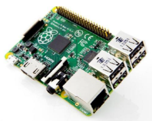
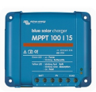

# Partie electronique 

## Le Raspberry Pi

Le Raspberry Pi est un nano ordinateur mono carte à
processeur ARM. Il permet l’exécution de plusieurs variantes du
système d’exploitation libre GNU/Linux et des logiciels
compatibles.

 

Le modèle utilisé pour le projet est le modèle B+ V1.2.
Il possède un processeur ARM à 4 coeurs d’une fréquence
d’horloge de 700 MHz. Il est capable d’assigner 16 registres
généraux (stockage temporaire des données) codés sur 32
bits. C’est-à-dire que les mots (signé ou non) manipulés par
le processeur peuvent prendre jusqu’à plus de 4 milliards de
valeurs (soit 232).

 

Sa mémoire vive (RAM) est de 512 Mo. La mémoire
vive est l'espace principal de stockage du microprocesseur,
mais le contenu disparaît lors de la mise hors tension de
l'ordinateur.

Il a 40 broches GPIO, c’est-à-dire des entrées/sorties. Elles permettent de
communiquer avec différents composants électroniques. Les connecteurs GPIO sont
généralement alimentés en 3.3Vcc et ne peuvent émettre que des courants de faible
capacité, allant de 3 mA à 50 mA. Cela lui offre d’être à la fois un ordinateur et un
contrôleur pour des applications purement électroniques.

Pour permettre la liaison, la communication et la sauvegarde des données il
possède également :
* Une prise d’alimentation micro-USB (700 mA),
* 1 sortie stéréo jack,
* 4 ports USB2,
* 1 port réseau ETHERNET (de 10 à 100 Mbits/seconde),
* 2 sorties vidéos (HMDI et prise RCA),
* Une micro SD card,
* Il a une consommation globale de 3 Watts.

Le Raspberry pi va donc nous permettre de :
* Récupérer les donner de la carte Arduino en python,
* Calculer la position du soleil avec python,
* Piloter les servomoteurs avec python,
* Gérer la récupération des données météo avec python,
* Rapatrier des données vers un fichier (Json ou .txt),

L’utilisation du Raspberry Pi B+ V1.2 va nous permettre de faire de la
programmation et de générer des pages web. En effet, il se comporte comme un microordinateur
et il est capable de créer des pages web sous format PHP ou HTML.
Le Raspberry pi va donc nous permettre de :
* Récupérer les donner de la carte Arduino en python,
* Calculer la position du soleil avec python,
* Piloter les servomoteurs avec python,
* Gérer la récupération des données météo avec python,
* Rapatrier des données vers un fichier (Json ou .txt),
* Gérer les données de sécurité du système,
* Héberger une interface WEB avec HTML, PHP et CSS.

## Contrôleur de charge MPPT

Un générateur photovoltaïque est un générateur qui est fortement non linéaire. En conséquence, pour un même éclairement, la puissance délivrée sera différente selon la charge.

Un contrôleur MPPT permet donc de piloter le convertisseur statique reliant la charge (une batterie par exemple) et le panneau photovoltaïque de manière à fournir en permanence le maximum de puissance à la charge (la batterie).

Une cellule solaire, comme une batterie, n’est pas, par nature, « intelligente ».
La majorité des panneaux solaires sont conçus pour produire, en théorie, un courant ayant une tension nominale de 12 Volts. En réalité la plupart de ces panneaux peuvent produire un courant dont la tension varie entre 16 Volts et 36 Volts.

Le problème réside dans le fait qu’une batterie fonctionne généralement avec une tension nominale de 12 Volts. Plus précisément entre 10,5 Volts et 12,7 Volts en fonction de son état de charge. Une batterie, lorsqu’elle est en charge, a besoin de 13,2 Volts à 14,2 Volts pour pouvoir se recharger complètement.
Ces valeurs sont sensiblement différentes des valeurs nominales produites par la plupart des panneaux solaires photovoltaïques.

Un régulateur MPPT (Maximum Power Point Tracking), ou « recherche du point de puissance maximum » en français, est un convertisseur électronique DC-DC qui optimise en permanence les paramètres électriques de fonctionnement entre les 3 systèmes suivants :
* Le système photovoltaïque (constitué d'un ou plusieurs panneaux solaires)
* Le dispositif batterie (composé d’une ou plusieurs batteries)
* Les applications utilisant l’énergie (moteur, pompe, éclairage, réfrigérateur, etc.)

Un régulateur MPPT recherche le point de puissance maximum, dont la valeur diffère de la valeur des tests en conditions standard dans presque toutes les situations.
Les régulateurs MPPT sont plus efficaces en Hiver (basses températures) et/ou temps nuageux ou brumeux. La chaleur faisant fluctuer la puissance produite par le panneau (plus la température est basse plus la puissance produite est importante et plus la température est élevée plus la puissance produite diminue).

* Par temps froid les panneaux solaires délivrent plus de puissance, mais sans l’emploi d’un régulateur MPPT, la quantité de puissance perdue est supérieure à celle récupérée en plus.
* Batterie faiblement chargée. Plus le niveau de charge de votre dispositif batterie est bas, plus le régulateur MPPT alimente celui-ci en courant électrique.
Le MPPT prend le courant continu dans les panneaux solaires, le transforme en courant alternatif haute fréquence, et le convertit à nouveau en un courant continu. C’est un convertisseur DC-DC.

Les systèmes de recherche du point de puissance (et tous les convertisseurs DC vers DC) fonctionnent sur le même principe : ils prennent le courant continu, le convertissent en courant alternatif (via un transformateur de type toroïdal) et le convertissent à nouveau en courant continu à la sortie du régulateur dont la tension et l’intensité sont parfaitement adaptées au dispositif batterie.

Ce processus est entièrement électronique dans la plupart des convertisseurs DC/DC classiques. Ces systèmes ne nécessitent pas vraiment d’ « intelligence » à l’exception de la phase de conversion lors de la régulation de sortie.
Les régulateurs de charge MPPT des panneaux solaires nécessitent, quant à eux, beaucoup plus d’ « intelligence » étant donné les variations intempestives de :
* l’intensité du rayonnement solaire,
* la température extérieure
* la tension du dispositif batterie.

Remarque : Il existe aujourd’hui plusieurs régulateurs MPPT analogiques. Ils sont plus faciles à concevoir et moins coûteux à produire que les régulateurs MPPT numériques. Ces régulateurs améliorent le rendement des panneaux, mais leur efficacité est très variable. Il arrive qu’ils perdent leur point de puissance, engendrant ainsi un rendement très mauvais. Cela peut arriver de façon occasionnelle si un nuage passe au-dessus des panneaux solaires. Le circuit linéaire recherche alors le point de puissance suivant, se cale dessus, mais est incapable de revenir au point précédent lorsque le nuage disparaît et que le soleil revient. Heureusement, cela n’arrive pas trop souvent.

