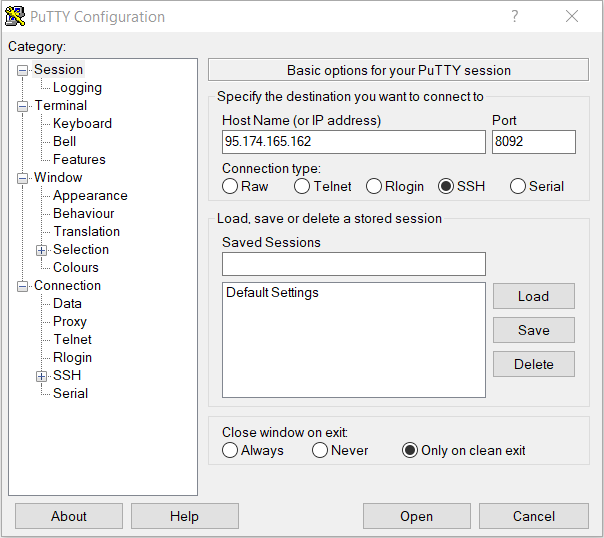
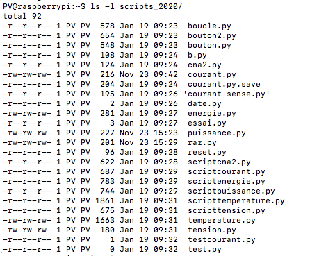
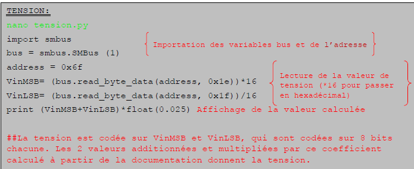

# Partie logiciel

## Programmation du Raspberry (PUTTY)

### Présentation

Le logiciel de programmation utilisée se nomme Putty, dans ce logiciel il est possible de venir écrire des lignes de programme en **python** qui vont nous permettre  de venir **lire et échanger** avec un ordinateur à distance ( dans notre cas un Raspberry pi4) et obtenir des relevées sur un Pc connecté au même réseau que le Raspberry.
 
Avec ces programmes nous sommes maintenant capables de demander au Raspberry les valeurs mesurées avec la carte électroniques. 

-------------

### Telecharger PUTYY

https://the.earth.li/~sgtatham/putty/latest/w32/putty.exe

-------------

### Connexion a PUTTY
 
<h4 align="center">SUR WINDOWS</h4>
 

**Adresse:** ``95.174.165.162`` 
**Port:** ``8092``  

<h4 align="center">SUR MAC</h4>
 

Ouvrir un terminal et entrer la commande:
``ssh PV@95.174.165.162 -p 8092``

### Identification:

**Identifiant**: ``PV`` 

**MDP**: ``*********``

-------------
### Commande sur PUTTY

Une fois connecté sous putty ou ssh plusieurs commande de base sont a connaitre :

* Pour lister un dossier: ``ls -l``  
En ecrivant cette commande on retrouve deux dossier (scripts_2019 et scripts_2020) qui regroupe tout les programmes qui vont nous etre utile pour le raspberry 
 

 

* Pour Rentrer dans le dossier, par exemple : ``ls -l scripts_2020/``  
 voici les dosier present dans ce scripts
 

 

* Pour éditer le fichier courant.py par exemple:``nano scripts_2020/courant.py``
 

* Exécuter un fichier python (courant.py) dans scripts_2020 : ``python3 scripts_2020/courant.py ``

* Pour copier un fichier par exemple (courant.py) du dossier scripts_2019 vers le dossier scripts_2020 : ``cp scripts_2019/courant.py scripts_2020/.`` 

**D'autres Exemple de communication de base du python** : 
 
``bus.read_byte_data(address, 0x27)`` est une commande qui nous permet en communiquant avec la
Raspberry (bus) de lire une donnée en octet (read_byte_data). 
Pour cela, il faut préciser l’adresse de
la carte de mesure que l’on veut interroger (address) ainsi que le registre que l’on veut lire qui est
codé en valeur hexadécimale (0x27).  

``bus.write_byte_data(address, 0x27, 0xff)`` est une commande fonctionnant exactement comme la
commande ci-dessus, elle sert à écrire une valeur dans un registre. 

-------------

## Programmation de pyscada

Récupérer les données sur putty nous permettent ensuite de pouvoir les traiter grâce à un logiciel de supervision
nommé PyScada. Avec ce logiciel, nous pouvons récupérer les valeurs de nos différentes cartes de
mesure, puis les afficher en graphiques (ou autres), les enregistrer, et y avoir accès à tout moment et
n’importe où. 

**Méthode de connexion à Pyscada :** 
1.  cliquer sur le lien si dessous 
http://95.174.165.162:8090  

2. Apres avoir cliquer sur le lien s'identifier  
 identifiant : ``PV`` 
mot de passe : ``tracker2020``  

Méthode pour créer un graphique 
1. Créer une page (qui viendra se placer dans la vue)
