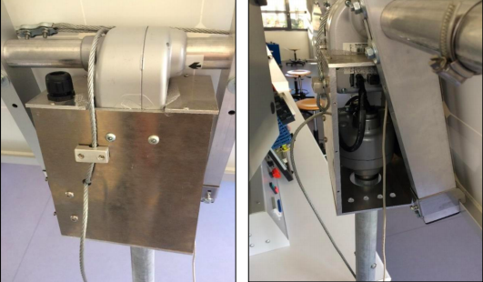

# Partie Matériel 

### Panneau solaire 

Panneau à 2 axes : 
Le tracker solaire, nous sert de source d’énergie électrique
continue de caractéristique 12V/150W et de surface 2m². Il a pour
possibilité d’être monté sur deux axes motorisé permettant de
suivre la course du soleil et ainsi optimiser son rendement.

### Batterie

#### Batterie au Gel Victron 110Ah 12V :
Dû à l’intermittence des périodes de production, l’installation de la batterie a été
nécessaire afin de réguler l’intensité. Elle a pour objectif de compenser l’énergie non
produite par le tracker. La batterie au Gel Victron est composée de matériaux d’une
grande pureté et de grilles de plomb/calcium qui garantissent à cette batterie au Gel
un très faible taux d’autodécharge.

### Servomoteur

Il s’agit d’un moteur professionnel avec positionneur
intégré et fond structural, pour la rotation automatique de
cellule solaire dans un intervalle de temps adaptable. Ces
appareils tournent la cellule solaire sur les axes horizontal et
vertical permettant d’exploiter au maximum le rayonnement
du soleil.
Les moteurs solaires sont alimentés par une source externe, 12VDC, et peuvent
résister à un vent de 130 km/h.

## Boitier 3D 
### Conception du boitier d’étanchéité

Le panneau solaire est fixé à un moteur, permettant de changer l’inclinaison
de celui-ci. Ce moteur est lui-même fixé sur un boitier en aluminium, lui-même
fixé au deuxième moteur permettant de gérer la rotation du panneau. Ce
moteur est fixé à un tube support. 
 
Le but de ce boitier est de protéger les deux moteurs de l’humidité et de la
pluie, et aussi de renforcer la structure qui soutient le panneau. Le problème
du précédent boitier est surtout l’étanchéité de celui-ci. En effet, les différentes
plaques étaient vissées entre elles, et de nombreux trous permettaient
l’infiltration de l’eau dans le boitier. Pour rigidifier la structure, un câble a était
mis en place entre le boitier et le panneau. Dernier point à modifier pour le
futur boitier, les câbles d’alimentation des moteurs et celui du panneau n’avait
pas assez de place dans le boitier. 

 
 
 

La première étape a été de récupérer les pièces sur SolidWorks du précédant
assemblage panneau/moteur/boitier. En récupérant ces différentes pièces, on
pouvait récupérer les différentes parties qu’on allait garder et améliorer. Nous
avons donc allongé le boitier pour donner plus de place aux câbles à l’intérieur
de celui-ci. Pour pouvoir accéder au câble, nous avons supprimé une des
plaques du haut du boitier. Nous avons pu garder l’emplacement des trous
prévue pour fixer les moteurs et les plaques entre elles. Le grand changement
sera de souder toutes les plaques entre elles pour renforcer l’étanchéité et la
solidité du boitier. Une seule pièce en aluminium sera juste fixée avec des vis,
la pièce en vert sur l’assemblage, pour pouvoir positionner le boitier sur le
moteur vertical.
Pour assurer cette étanchéité, nous avons pensé à rajouter un cache en
aluminium sur le boitier et sur le moteur, pour éviter que la pluie entre dans
celui-ci.

 

  

